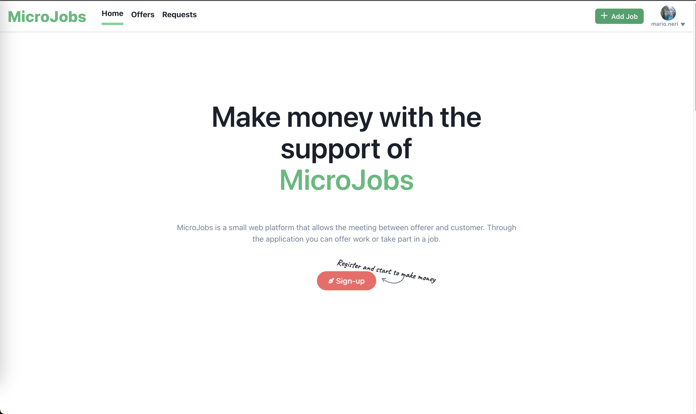
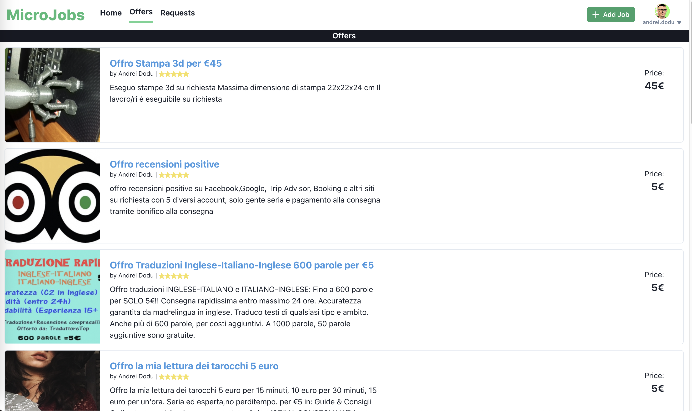

This is the front-end of the MicroJobs project. Look [here](https://github.com/goto-eof/micro-jobs-server) for the back-end project.

# Run

```
yarn install && yarn start
```

# Default username and password
```
username: admin
password: Micr@J@bs
```

# Screenshot

## Home page



## Offers page



## Conversation page


## Admin panel page


For any information, feel free to [contact me](http://andre-i.eu/#contactme).

